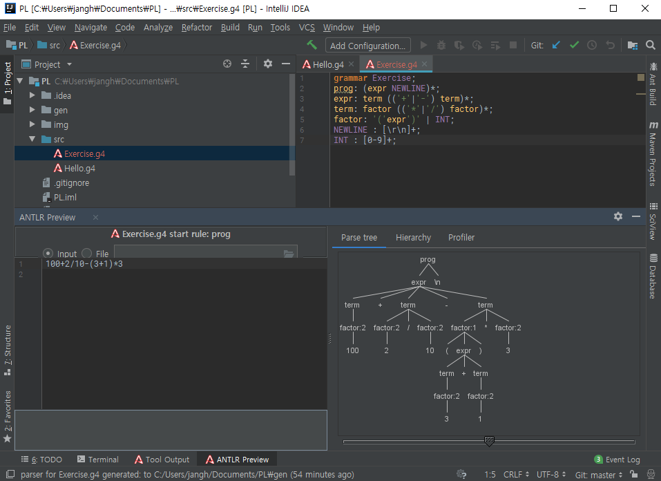
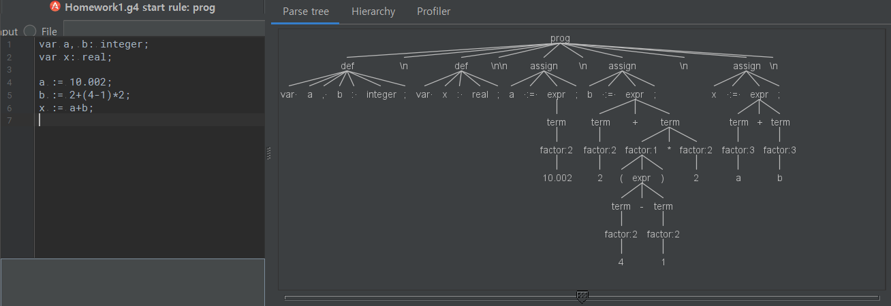
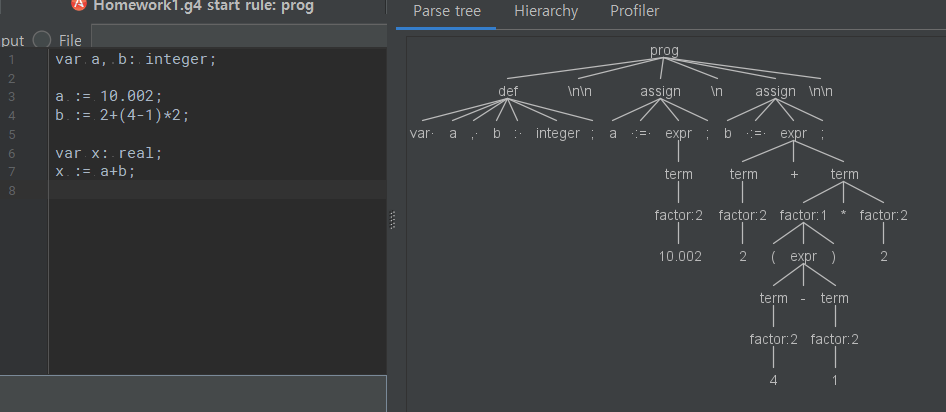
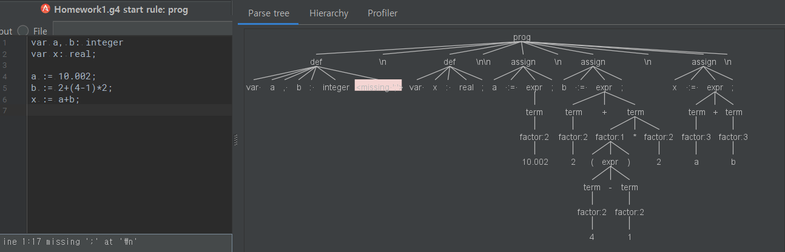

# PL
2018년 2학기 Programming language 실습과 과제

## 과제 진행

[IntelliJ](https://www.jetbrains.com/idea/) + [ANTLR V4 grammar plugin](https://plugins.jetbrains.com/plugin/7358-antlr-v4-grammar-plugin)

IntelliJ에 ANTLR V4 gammar plugin 설치 : [유튜브](https://www.youtube.com/watch?v=svEZtRjVBTY)

[ANTLR getting started 문서](https://github.com/antlr/antlr4/blob/master/doc/getting-started.md)로 퀵스타트

1. g4 파일 생성
2. grammar 작성
   ```g4
   // Define a grammar called Hello
    grammar Hello;
    r  : 'hello' ID ;         // match keyword hello followed by an identifier
    ID : [a-z]+ ;             // match lower-case identifiers
    WS : [ \t\r\n]+ -> skip ; // skip spaces, tabs, newlines
    ```
3. g4 파일에서 오른쪽 마우스 클릭 - Generate ANTLR Recognizer 선택
4. g4 파일에서 테스트하고 싶은 룰에서 오른쪽 마우스 클릭 - Test Rule 선택
5. 아래창에 소스 코드 입력
6. 파스트리 확인


## Excercise I
Write a grammar that can evaluate 4 basic math operations (+, -, *, /)
```g4
grammar Exercise;
prog: (expr NEWLINE)*;
expr: term (('+'|'-') term)*;
term: factor (('*'|'/') factor)*;
factor: '('expr')' | INT;
NEWLINE : [\r\n]+;
INT : [0-9]+;
```


## Homework I
Write a grammar for a calculator language

```
var a, b: integer;
var x: real;

a := 10.002;
b := 2+(4-1)*2;
x := a+b;
```

- The language will have a set of statements including
declarations, assignments, and expressions.
    - Declarations must come before other statements like C/C++.
    - Each statement must end with a semi-colon.
    - The four basic arithmetical operations (+, -, *, and /) consisting of variables and numbers have to be provided
- Only positive integer and real numbers (no signed
numbers); no scientific notation (e.g., 6E+5)

```g4
grammar Homework1;
prog: (def NEWLINE)*(assign NEWLINE)*;
def: 'var ' ID (', ' ID)* ': ' ('integer' | 'real') ';';
assign: ID ' := ' expr ';';
expr: term (('+'|'-') term)* ;
term: factor (('*'|'/') factor)*;
factor: '('expr')' | NUM | ID;
NEWLINE : [\r\n]+;
ID: ([A-Z]|[a-z]|'_')+;
NUM : [0-9]+('.'[0-9]+)?;
```




