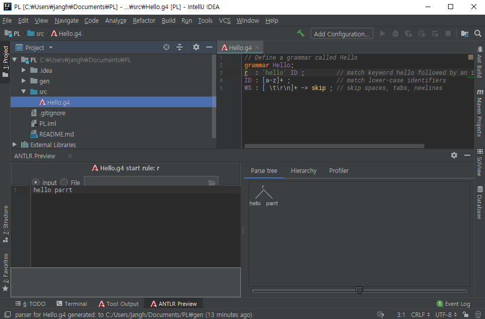
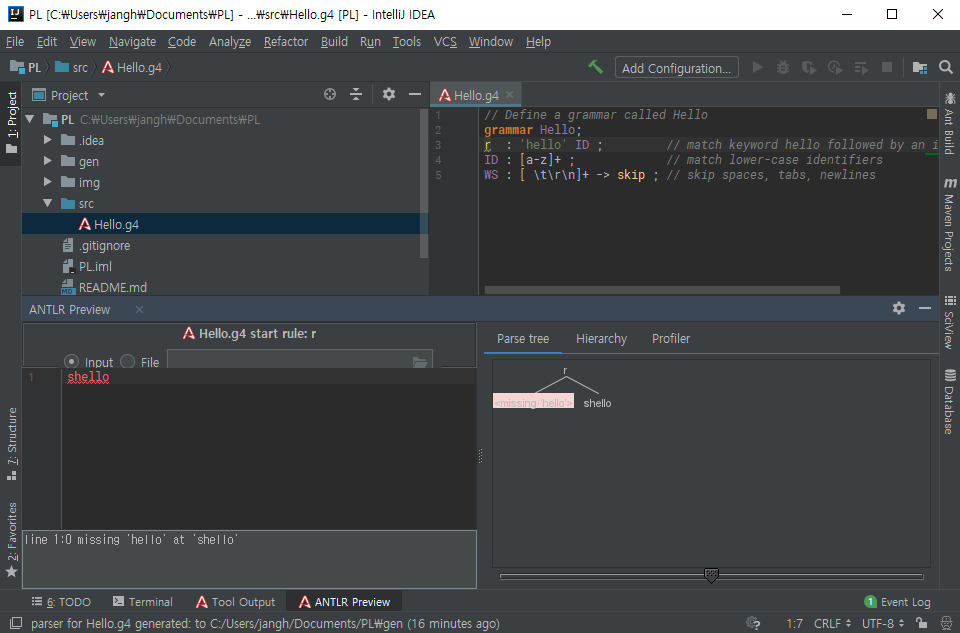

# PL
2018년 2학기 Programming language 실습과 과제

## 과제 진행

[IntelliJ](https://www.jetbrains.com/idea/) + [ANTLR V4 grammar plugin](https://plugins.jetbrains.com/plugin/7358-antlr-v4-grammar-plugin)

IntelliJ에 ANTLR V4 gammar plugin 설치 : [유튜브](https://www.youtube.com/watch?v=svEZtRjVBTY)

[ANTLR getting started 문서](https://github.com/antlr/antlr4/blob/master/doc/getting-started.md)로 퀵스타트

1. g4 파일 생성
2. grammar 작성
   ```g4
   // Define a grammar called Hello
    grammar Hello;
    r  : 'hello' ID ;         // match keyword hello followed by an identifier
    ID : [a-z]+ ;             // match lower-case identifiers
    WS : [ \t\r\n]+ -> skip ; // skip spaces, tabs, newlines
    ```
3. g4 파일에서 오른쪽 마우스 클릭 - Generate ANTLR Recognizer 선택
4. g4 파일에서 테스트하고 싶은 룰에서 오른쪽 마우스 클릭 - Test Rule 선택
5. 아래창에 소스 코드 입력
6. 파스트리 확인


